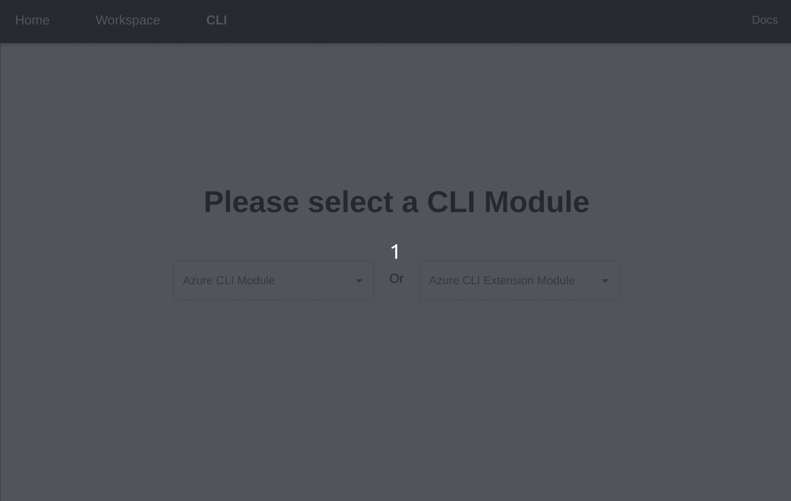
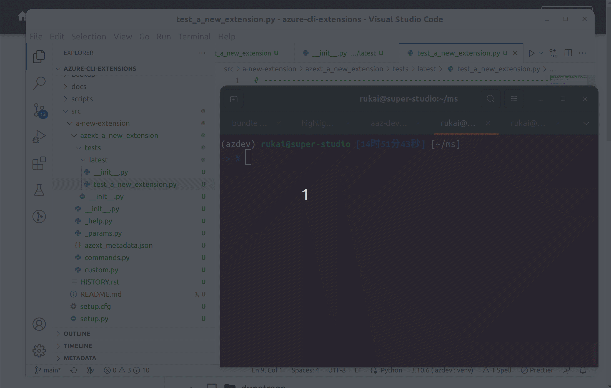
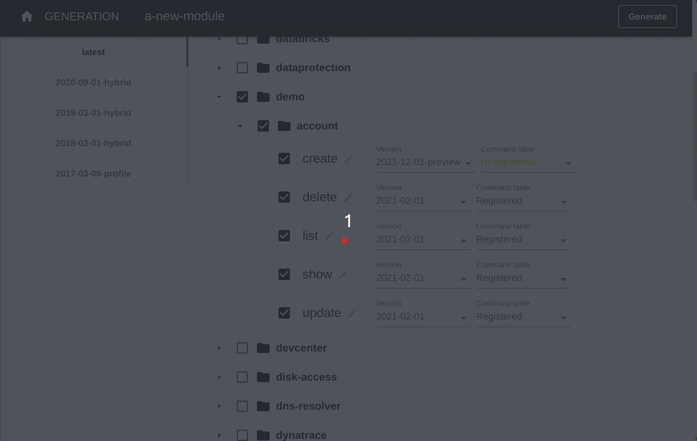

CLI generators are used to generate code in azure-cli from command models. You can generate code in any module of azure-cli repo or extension of azure-cli-extension repo. The generated code will be in the **aaz** subfolder. We call the generated commands **aaz** commands.

## Module or extension

CLI commands are separated into different modules in Azure CLI repo or extensions in Azure CLI extension repo. Different modules/extensions are owned and maintained by different contributors. So the first step is to select an existing module/extension or create a new one before code generation.

Please reference this [doc](https://github.com/Azure/azure-cli/blob/dev/doc/onboarding_guide.md#extension-vs-module) for the difference between an extension and a module.

### Create a new module in azure-cli

The left drop-down menu is used to select and create a module of **azure-cli** repo.



### Create a new extension in azure-cli-extensions

The right drop-down menu is used to select and create an extension of **azure-cli-extensions** repo.


> **Note**
>
> If you want to run the commands in an extension in development, please make sure the extension is installed in the development environment. You can use the following command to install the extension:
>
> ```bash
> azdev extension add your-extension-name
> ```
>
> Sometime the above commands may raise `extension(s) not found: your-extension-name` error. It's caused by missing the correct extension repo path in your development environment. You can use the following command to setup the extension repo path:
>
> ```bash
> azdev extension repo add ./azure-cli-extensions
> azdev extension repo list
> ```



## Generation

In the **GENERATION** page, it will list all the commands of **local** aaz repo in a tree view. So you can find the commands exported from workspace editors. This page will also select the generated commands in current module/extension by default.


### Pick commands

You can pick the commands you want to generate code. If the command has multiple versions, you can select the version you want to generate. Every time you pick or unpick a command or change the version of it, the `pan` icon will turn blue, which means it's modified in your selection. Once you have done the selection, press the `Generate` button on the right top. You have two ways for generation:

- Generate All: Will generate both modified or unmodified commands in the selection, which means regenerate all in the `aaz` folder of your module/extension.
- Generate Edit Only: Sometimes it takes a long time to generate all commands in selection, you can use this button to update modified commands in the selection. It's very helpful for the module/extension with hundreds of existing selected commands.


#### Unregistered commands

Most commands will be exported as **Registered** commands, which will register in azure-cli-core command table and became visible for cli users.

The **Unregistered** commands will be used for generate code only, but will not register the the code as a command in azure-cli-core command table, so that you can use the generate code in other manuel commands without change the command table.


### Remove commands

When you unpick some commands in selection and regenerate the code, the unpicked commands will be removed.



### About profiles

In azure-cli, there are 5 profiles right now. The `latest` profile will contains all the commands in the **latest** version, the rest profiles are used to support azure stack. You can reference the following links to learn more about azure stack:

- [Manage API version profiles in Azure Stack Hub](https://learn.microsoft.com/en-us/azure-stack/user/azure-stack-version-profiles?view=azs-2301)
- [Profiles in azure-rest-api-specs](https://github.com/Azure/azure-rest-api-specs/tree/main/profile)

In CLI generator, the left column list all the profiles and highlight the current selected profile. You can select command in different versions for different profiles.

The sub folders of **aaz** in the module/extension represent each profiles. For example, if your commands are available for both `latest` and `2020-09-01-hybrid` profiles, there will be `latest` and `2020_09_01_hybrid` folders in generated code.


### Miss command models

When you open a module/extension, you may encounter `Miss command groups in aaz:...` error. That's because in your module/extension, some commands generated but in your local `aaz` repo the related command models don't exist. It can be resolved by two ways:

#### Sync the latest change of `aaz` repo in upstream

One reason is that your `aaz` repo is out of date. Please pull the latest change of `main` branch in [aaz repo](https://github.com/Azure/aaz).


> **Note**
>
> When you finish the azure-cli development, please submit your change of `aaz` repo to [Azure aaz repo](https://github.com/Azure/aaz) so that the following developer will not missing command models.

#### Clean the generated code

Sometime when you develop commands, you may generate command in name A and then rename it by name B. That will cause the command model for name A not exist. For this cause, you clean the command code for name A.


