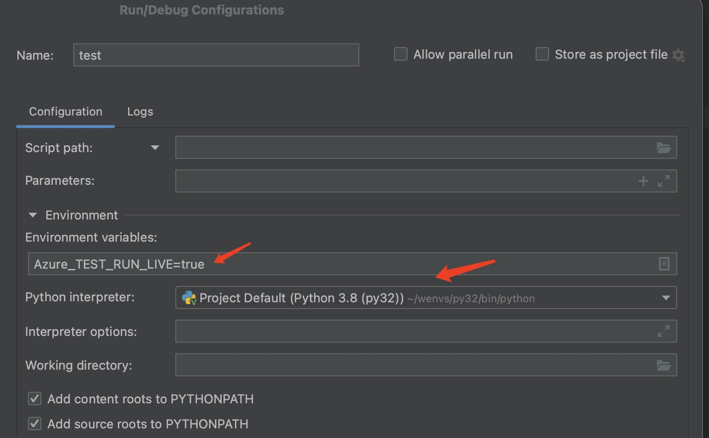

## Command Usage

### Before

1. Make sure you have login by `az login`.
2. Make sure you have set the subscription by `az account set -s {subscription ID for test}`.
3. You can try to create a empty resource group by `az group create --name {your resource group name} --location westus` to check if you have the permission to the cloud.
4. If your commands are in extensions, make sure you have loaded this extension by `azdev extension add {your extension name}`.

### Run your commands

After that, you can directly try the generated command such as `az new-group-name new-command-name --the-arg value`.

There are some tips for you to use the generated command:

1. You can add `--help` argument flag to get and verify the help information of the command. Such ass `az new-group-name new-command-name --the-arg value --help`
2. For issue debugging, you can add `--debug` argument flag to print out the debug logs, which will contains all the http requests and responses, to help you triage the issue. If you need feature help from azure-cli team, please always provide this logs for us.
3. The compound arguments generated supports [shorthand syntax](https://github.com/Azure/azure-cli/blob/dev/doc/shorthand_syntax.md) to input values.

## Provide tests

It is required to providing tests for the change. Please reference this [doc](https://github.com/Azure/azure-cli/blob/dev/doc/authoring_tests.md) for details.

Details about these two types of testing, env preparation, test policies and issue troubleshooting, please refer to the [doc](https://github.com/Azure/azure-cli/blob/dev/doc/authoring_tests.md)

After generating code from CodeGenV2, target cmd's test can be added into folder `path/to/your/cloned/azure-cli/target_mod`. Below is the demonstration of tests using azdev and [Pycharm Community](https://www.jetbrains.com/pycharm/download/#section=linux)

### Run tests

The `azdev test` command can help you run tests for your code, please check help message of `azdev test --help`.

When first run tests, use `--live` to make live request to apis and it will help record payloads in `yaml` file for CI playback validation.
```
azdev test test_function_of_your_code --live
```

For `Pycharm` users, please set env `Azure_TEST_RUN_LIVE` to be `true` for live mode and `false` for non-live mode.



> **Note**
>
> When you recording tests, please make sure the latest change of `dev` branch of **azure-cli** has been synced to your local repo.
> Developers will always encounter this issue when the tests passed locally but failed in CI. This is because the api versions used by commands of **azure-cli** can be changed in `dev` branch. When the tests recorded in your local may uses out of date azure-cli commands, the recording will be failed in CI. That's why we need to sync the latest change of `dev` branch of **azure-cli** before recording tests.
