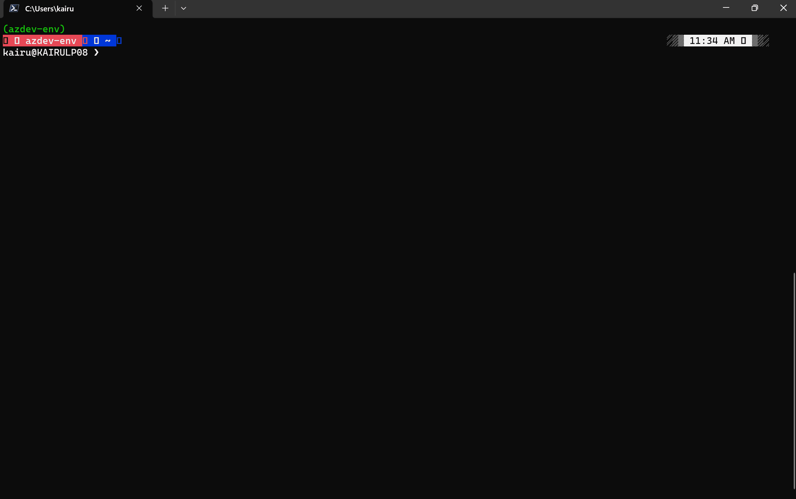
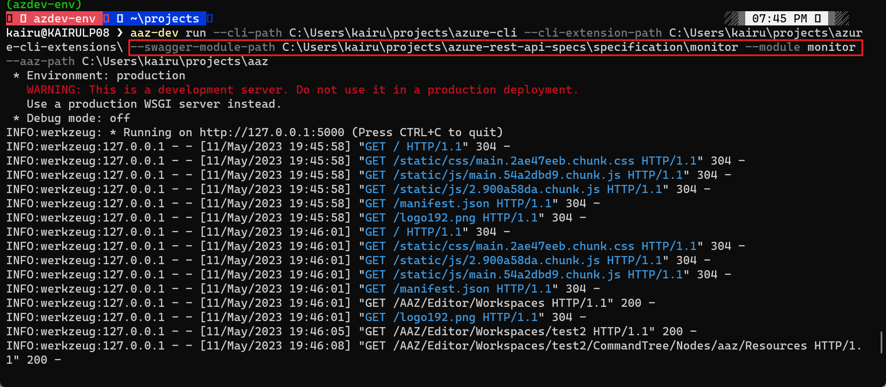

## Setup python

### Setup build env

- For Linux users, setup python3 build tools would avoid other unseen installation issues
    ```bash
    apt install python3-dev build-essential # Ubuntu, Debian 
    yum install python3-devel # Centos
    ```

### Install python

This tool is compatible with python versions >=3.8 and <=3.10. You can use an existing python or install a new one by the following ways:

- For Windows users: You can download and run full installer from [Python Download](https://www.python.org/downloads/).
- For Linux users: You can install python from Package Manager or build a stable release from source code

After installation, you can run the following commands to check the version:
- For Windows users:
    You can run:
    ```PowerShell
    C:\Users\{xxxx}\AppData\Local\Programs\Python\Python3{xxxx}\python --version
    ```
    __C:\Users\{xxxx}\AppData\Local\Programs\Python\Python3{xxxx}__ is the python installation path.
- For Linux users:
    ```bash
    python --version
    ```
    You can also specify the version number when you have multiple versions installed like this:
    ```bash
    python3.8 --version
    ```

### Setup a virtual environment

Please create a new virtual environment for Azure CLI development to isolate from the system environment.

You can run the following command to create a new virtual environment:

- For Windows users:
    ```PowerShell
    C:\Users\{xxxx}\AppData\Local\Programs\Python\Python3{xxxx}\python -m venv {some path}\{venv name}
    ```
- For Linux users:
    ```bash
    python3.8 -m venv {some path}/{venv name}
    ```

### Active existing virtual environment

You should __always__ activate the virtual environment for azure-cli development. When a virtual environment is activated, the `python` command will always be the `python` that created this virtual environment.

- For Windows users:
    - Powershell
        ```powershell
        {some path}\{venv name}\Scripts\Activate.ps1
        ```
    - Command Prompt
        ```Command Prompt
        {some path}\{venv name}\Scripts\activate.bat
        ```
- For Linux users:
    ```bash
    source {some path}/{venv name}/bin/activate
    ```

### Install tools for azure-cli development

Install [azure-cli-dev-tools](https://github.com/Azure/azure-cli-dev-tools):

```bash
pip install azdev
```

Install [aaz-dev-tools](https://github.com/Azure/aaz-dev-tools)

```bash
pip install aaz-dev
```

### python-levenshtein installation issues

- For Windows users, dependency python-levenshtein installation might run into trouble. developers might need to download [.whl](https://www.lfd.uci.edu/~gohlke/pythonlibs/#python-levenshtein) file and install it manually (reference to [link](https://stackoverflow.com/questions/37676623/cant-install-levenshtein-distance-package-on-windows-python-3-5/46414982))

## Code repos setup

### Fork and clone repos

`aaz-dev-tools` relies on the following repos, Please `Fork` these repos in your GitHub account and `Clone` them in your local disk. After clone, you can add `upstream` for every repo in your local clone by using `git remote add upstream`.

- Azure CLI code repos:
    - [Azure CLI](https://github.com/Azure/azure-cli): Before start to the development task, you should always sync the code in the `dev` branch of `upstream`(Azure/Azure-cli). If your commands will be generated to azure-cli repo, you should checkout a new branch with `feature-` prefix.

    - [Azure CLI Extension](https://github.com/Azure/azure-cli-extensions): If your commands will be generated to azure-cli-extension repo, you should sync the code in the `main` branch of `upstream`(Azure/Azure-cli-extensions), and checkout a new branch with `feature-` prefix.

- AAZ command models repo:
    - [AAZ](https://github.com/Azure/aaz): This repo is used to upload the command models generated. Before start to the development task, you should always sync the change in the `main` branch of `upstream`, and checkout a new branch with `feature-` prefix.

- Azure OpenAPI Specs repos:
    - [azure-rest-api-specs](https://github.com/Azure/azure-rest-api-specs)
    - [azure-rest-api-specs-pr](https://github.com/Azure/azure-rest-api-specs-pr)

### Use **azdev setup** to setup azure-cli development environment

You should __always__ run the following command every time you sync `azure-cli` code of `upstream`.
```bash
azdev setup --cli {path to azure-cli} --repo {path to azure-cli-extensions}
```

## Run **aaz-dev-tools**

### Quick start

The following command will start a backend service and open a web page in the browser.

```bash
aaz-dev run --cli-path {path to azure-cli} --cli-extension-path {path to azure-cli-extensions} --swagger-path {path to azure-rest-api-specs or azure-rest-api-specs-pr} --aaz-path {path to aaz}
```



### Other arguments

- `-p, --port`: This argument can specify the port to bind.
- `-w, --workspaces-path`: This argument can specify the folder to save workspaces.

#### Use swagger files which is not in **azure-rest-api-specs** repos

You can use the following arguments to specify swagger files for a specific resource provider:

- `--swagger-module-path, --sm`
- `-m, --module`

```bash
aaz-dev run --cli-path {path to azure-cli} --cli-extension-path {path to azure-cli-extensions} --aaz-path {path to aaz} --swagger-module-path {path to swagger files in module level} --module {the name of module}
```


