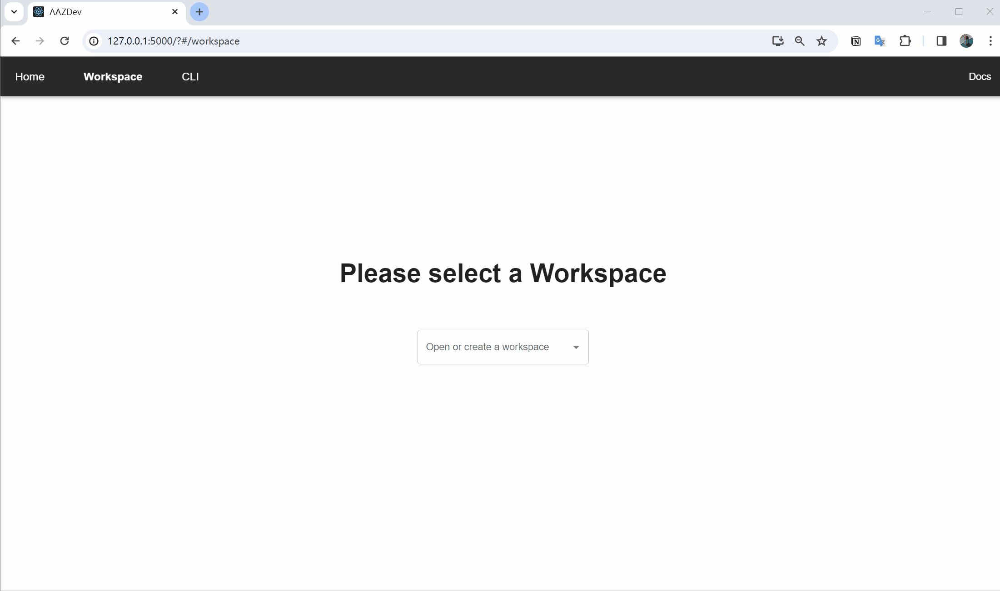
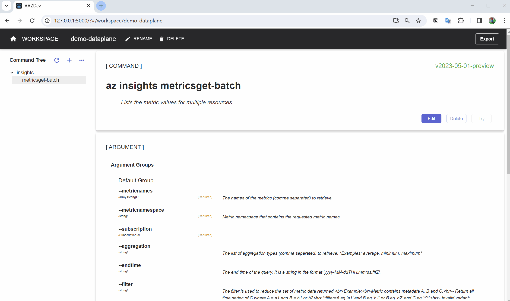
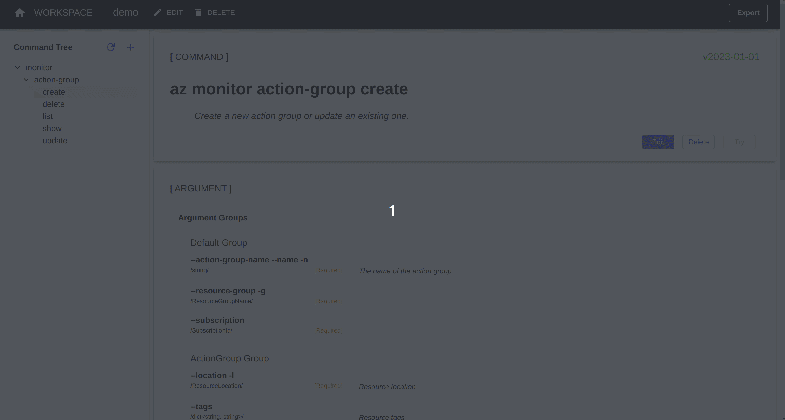
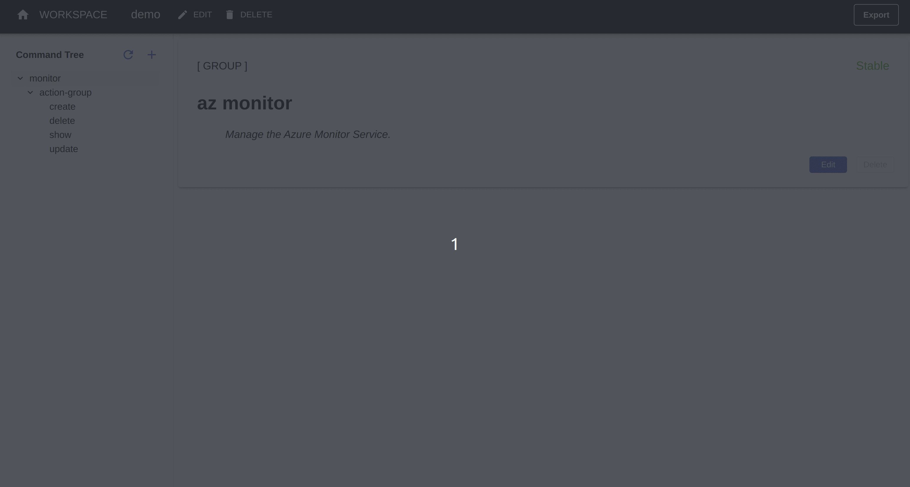
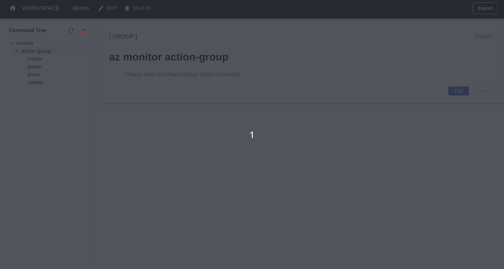

Workspaces are used to save and edit command models before exporting them to `aaz` repo. They are isolated with each other. So you can create multiple workspaces for different purpose. And they are saved in `~/.aaz/workspaces` folder by default.

## Workspace operations

When using aaz-dev from scratch, the workspace editor is the starting point. A workspace should service to only one resource provider in the control/data plane.

### Create a workspace

In workspace page, the drop-down menu can select an existing workspace or create a new one.


### Rename a workspace

Click the `EDIT` button you can rename the opened workspace.


### Delete a workspace

Click the `DELETE` button you can delete the opened workspace. It requires to input workspace name again to confirm.

> **Warning**
>
> aaz-dev does not support **Undo**. Once the workspace is deleted you cannot get it back unless you use `git` to manage the workspaces folder (default path is `~/.aaz/workspaces`).


## Data-Plane Client

The data-plane client configuration is required for data-plane commands. It's a resource provider level configuration, which means all data-plane commands in one resource provider will share one configuration.

In the client configuration, the client `endpoint` and `authorization` mechanism should be provided.

In workspace you can set two kinds of `endpoint`:

- Template endpoint: The endpoint follows a special template. The template supports using placeholder which is wrapped by `{}`. For example: `https://{keyVaultName}.vault.azure.net`. Those placeholders will generate arguments, which arg group name is 'Client Args', in all commands.
- Dynamic endpoint (Coming soon): The endpoint should be retrieved from a property value in a control plane api response.  

For tha `authorization` mechanism, we supports `AAD` auth.

When you try to create command for a new resource-provider of data-plane, the workspace will require you set the client configuration at first.


If you want do some modification in existing client configuration, you can click the `Edit Client Config` button. The change will apply to all the data-plane commands of that resource-provider when you export models from the workspace to aaz.


## Add Swagger Resources

When an empty workspace is opened, the `Add Swagger Resources` page will be prompted out by default.

For a workspace contains commands, click the `+` button besides the `command tree`, the `Add Swagger Resources` page will prompted out as well.


### Swagger Filters

The Swagger Filters can help you quickly filter out the resources to generate commands. They are

- Swagger Module selector
- Resource Provider selector
- API Version selector


### Pick Resource Urls

After the resources are filtered, you can select the resource urls on the right table.

> **Note**
>
> For the resources already added in the current workspace, their urls will be filtered out in the table. That's by design to avoid you add the same resource multiple times in one workspace, even in different api-versions is not allowed.

You can select them `All` or only pick some of them on demand which is recommended for beginners. You can also use the `Filter` bar to filter out a table by some keywords or the path key in swagger.

Click `Submit` button will generate command models in workspace and back to the workspace page. Those new commands are added in the command tree.


### Inherit modifications from exported command models

While adding a swagger resource, aaz-dev supports to inherit modifications directly from command models of the same resource generated and exported in `aaz` repo. This avoids many repetitive works. You can select different versions to inherit.


### The generation of **Update** commands

There are two mechanisms to implement `Update` in azure-cli.

- Generic Update: use `Get` request to fetch the resource, modify the resource and use `Put` request to submit the whole modified resource. About **99%** `Update` commands in azure-cli use this mechanism.
- Patch Update: use `Patch` request to submit the change only.

There's three modes to control the generation of `Update` commands while add the resources.

- Generic(Get&Put) First: If the resource supports `Get` and `Put` methods, generate the _Generic Update_, else if it supports `Patch` method, it generate the _Patch Update_.
- Patch First: If the resource supports `Patch` method, it generate the _Patch Update_, else if it supports `Get` and `Put` methods.
- No update command: Never generate `Update` commands for the resource.

> **Note**
>
> This selection will apply to all the resources to submit. So if some of the resources should use a different mode, you should pick and submit them in the next new `Add Swagger Resources` page with a different mode.


### Issues while adding swagger

The aaz-dev tool uses strict mode to parse swagger. It will cause problems when adding swagger resources if the swagger files contains non-standard definitions. If you encounter such problem, you should check the **logs** of aaz-dev **backend service** and post it in [_Team Channel_](https://aka.ms/azure-cli-codegen-channel) or create a github issue.


## Modify Command Tree

All the commands in a workspace are organized in a tree view. When you rename or delete commands or command groups the tree view will be updated. Usually it is the first step after resources are added,

### Rename Command/Command Group

When you select a command or group name in the tree view, its details are displayed in the right area. Click the `Edit` button, you can rename it in the `Name` field. The name are composed of some keywords and are separated by spaces. Every keyword is represented for a node or leaf in the command tree. And the keyword should be in [Kebab_case](https://en.wikipedia.org/wiki/Letter_case#Kebab_case). You can reference [Command Naming Guideline](https://github.com/Azure/azure-cli/blob/dev/doc/command_guidelines.md#command-naming-and-behavior) for more information.

If you rename a group name, it will update all the elements names in its sub tree. If you add a new group name in a command, it will be moved to a new sub tree.


### Delete Command Group

You can delete an empty command group which has no commands in its sub tree. If it contains any commands, the `Delete` button is not clickable.


### Delete Commands

The commands in workspace are deleted by the swagger resource, if a resource generates `create`, `delete`, `update` and `show` commands, they will be deleted together.



> **Note**
>
> Sometimes a command contains multiple resource urls, usually the `list` command. You should delete it multiple times. Because the resources should be removed one by one.



### Merge similar resource urls in one command

aaz-dev supports to merge similar resource urls in one command. But there are the following restrictions:

- All the resource urls are for the same resource, which means they should have the same swagger schema definition in responses.
- Every resource should **only** have a `GET` method. aaz-dev cannot support to merge `create`, `delete` or `update` command right now.

If you want to merge some resource urls in one command, you should select them in the same submission on `Add Swagger Resources` page.



But sometimes two resources cannot be merged because the `valid part` of the url is different. In this case, you can add one resource first and rename its command to the same command name as the resource you are adding next, then add the next resource.


> **Note**
>
> If you're trying to avoid the default merging behavior, you should can add one fist, rename the command to something different to avoid automatic merging, then add the following one.


## Modify Help for Commands and Groups

There are two kinds of summaries for commands and command-groups:

- Short Summary: Will be displayed in the help of the parent level and itself. **It's required for all commands and groups**
- Long Summary: Only be displayed in its help. It's optional. Supports multiple lines.

Click the `Edit` button, you can fill the `short summary` and `long summary` fields.


## Modify Command

### Command Confirmation

The confirmation message of a command is prompted before it runs. aaz-dev will add default confirmation for all `delete` commands. If you want to disable it, you can clean up the `Command confirmation
` field in it.


## Modify Arguments

### Browse Arguments

The command view has the `ARGUMENT` card to display all of the arguments. You can click into any argument to review the detail. And click the index buttons, you can go back to previous views.


### Argument Types

Arguments can be divided into two categories:

- Simple Arguments
- Compound Arguments

#### Simple Argument Types

Most arguments are mapping from the `type` field plus the `format` field (if defined) in swagger. They are shown in the table below:

| Argument Type         | Swagger type **+** _format_ | Comments                                                                                                                                                                                      |
| --------------------- | --------------------------- | --------------------------------------------------------------------------------------------------------------------------------------------------------------------------------------------- |
| **boolean**           | boolean                     | Its _blank value_ is `True`, which is compatible with current tree state argument types in azure-cli                                                                                          |
| **integer**           | integer                     | Support swagger [`enum`](https://swagger.io/docs/specification/2-0/enums/), [`x-ms-enum`](http://azure.github.io/autorest/extensions/#x-ms-enum), `multipleOf`, `maximum` and `minium` fields |
| **integer32**         | integer **+** _int32_       | 32-bit                                                                                                                                                                                        |
| **integer64**         | integer **+** _int64_       | 64-bit                                                                                                                                                                                        |
| **float**             | number                      | Support swagger `enum`, `x-ms-enum`, `multipleOf`, `maximum`, `minium`, `exclusiveMaximum` and `exclusiveMinimum` fields                                                                      |
| **float32**           | number **+** _float_        | 32-bit                                                                                                                                                                                        |
| **float64**           | number **+** _double_       | 64-bit                                                                                                                                                                                        |
| **string**            | string                      | Support swagger `enum`, `x-ms-enum`, `pattern`, `maxLength` and `minLength` fields                                                                                                            |
| **string**            | string **+** _uri_          |                                                                                                                                                                                               |
| **duration**          | string **+** _duration_     | Use [ISO 8601 duration format](https://www.digi.com/resources/documentation/digidocs//90001488-13/reference/r_iso_8601_duration_format.htm)                                                   |
| **date**              | string **+** _date_         | Use `yyyy-mm-dd` date format                                                                                                                                                                  |
| **time**              | string **+** _time_         | Use `hh:mm:ss.xxxxxx` time format                                                                                                                                                             |
| **dateTime**          | string **+** _date-time_    | Use  [ISO 8601 date format](https://www.digi.com/resources/documentation/digidocs//90001488-13/reference/r_iso_8601_date_format.htm)                                                          |
| **uuid**              | string **+** _uuid_         |                                                                                                                                                                                               |
| **password**          | string **+** _password_     | Support prompt input when user provide _blank value_                                                                                                                                          |
| **ResourceId**        | string **+** _arm-id_       | Arm resource id input file. It will enable azure cli _Cross Tenants Authenticate_ when it contains different subscription id.                                                                 |
| **SubscriptionId**    | string                      | Subscription parameter in the url path.                                                                                                                                                       |
| **ResourceGroupName** | string                      | Resource group parameter in the url path.                                                                                                                                                     |
| **ResourceLocation**  | string                      | `location` property in the request body.                                                                                                                                                      |

#### Component Argument Types

The arguments are mapping from the `type` field plus some special field in swagger. They are shown in the table below:

| Argument Type         | Swagger type  **+** SpecialField           | Comments                                                                                   |
| --------------------- | ------------------------------------------ | ------------------------------------------------------------------------------------------ |
| **object**            | object + `properties` field                | Properties' names and schemas defined in `properties` field.                               |
| **dict<string, \*>**  | object + `additionalProperties` field      | The key is string type and the value schema is defined in `additionalProperties` field.    |
| **dict<string, Any>** | object + `additionalProperties=true` field | Free-form dictionary, which doesn't define the value schema. So the value can be any type. |
| **array<\*>**         | array + `items` field                      | The element schema is defined in `items` field.                                            |

> **Note**
>
> aaz-dev doesn't support swagger using `object` type + `properties` field + `additionalProperties` field.

### Modify Argument options

Click the `Edit` button, you can update the argument options in that field. Multiple options are separated by space. They should be in [Kebab_case](https://en.wikipedia.org/wiki/Letter_case#Kebab_case).


> **Note**
>
> If similar arguments exist in other commands, you can use `Update Similar` button when submitting. It will find the similar arguments in other commands of current workspace.


### Using Singular Option Names

For the `array` type argument, it has `Singular option names` field to specify the singular options. A `singular option` flag can accept an element as the value instead of an array.


> **Note**
>
> This is by design for backward compatibility with existing commands and is not recommended for new commands. So by default, it is unset.

### Flatten Argument

Some arguments have internal properties. For an `object` type argument, when it's neither an array element nor a polymorphism argument, you can flatten its properties to the upper level.


> **Warning**
>
> aaz-dev does **NOT** support revert flattened argument. If you want to undo flatten, the simplest way is deleting the command and regenerate it from swagger again.

### Required and Optional Arguments

Whether the argument is required or optional is generated from Swagger.
In swagger, because the properties are in a hierarchical structure, there's a transmission chain for required properties. It will affect the argument.
If an optional property is flattened, it's required properties will be optional in the parent level.

**Example**
if a resource has the following properties:

``` bash
Prop_A (required)
Prop_B (optional)
    L sub_1 (required)
    L sub_2 (optional)
```

It will generate the following arguments in command level:

``` bash
--prop-a (required)
--prop-b (optional)
```

Inside the optional argument `--prop-b`, its sub arguments will be:

``` bash
   .sub-1 (required)
   .sub-2 (optional)
```

When you flatten `--prop-b`, the argument in command level will be:

``` bash
--prop-a (required)
--sub-1 (optional)
--sub-2 (optional) 
```


> **Note**
>
> aaz-dev does **NOT** support to change argument from optional to required.
> If you such needs, you should always check and fix the transmission chain in Swagger.
> There's a common issue in swagger:
> aaz-dev will flatten the **properties** property in resource level by default.
> When it is optional, the required sub arguments will become optional in command level.


### Hidden Arguments

While editing the arguments, you can hide it. The code of hidden arguments will **NOT** be generated in azure-cli, so the users cannot pass a value for hidden arguments. The command models in aaz will keep the hidden arguments, and you can enable them in the future.  


### Default value for Arguments

You can set `Default` value for an argument, the `Default` value will be used when users not declare this argument in the command.

When a required argument has `Default` value, it will become optional in the command help.


> **Warning**
>
> Do **NOT** set `Default` value of arguments in `update` commands using generic update mechanism. Because generic update will use `GET` to fetch the resource and use `PUT` to update the whole. So the default value of properties should comes from the `GET` response **NOT** the argument `Default` value.

> **Note**
>
> The `Default` value is different from the `Blank` value. `Blank` value is used when user declared the argument but didn't pass a value in it.
> For example if the `--arg` has both `Default` value and `Blank` value,
> When user run command without `--arg`, the `Default` value is used:
>
> `az some-command --name name --group group`
>
> When user run command with `--arg`, but with no value added, the `Blank` value is used:
>
> `az some-command --name name --group group --arg`
>
> In aaz-dev, you can only modify `Default` value for the argument right now.

### Prompt Input for Arguments

aaz-dev support prompt input for arguments when user declared it but didn't pass a value for it. There are two kinds of prompt input:

- Prompt Input: The value is displayed during input.
- Password Prompt Input: It is used for the password prompt input of the `Password` arguments, and the value is **NOT** displayed during input, and it supports secondary input confirmation.


### Class Argument Type

If an argument schema is used by multiple place, aaz-dev will create a class type for it. If you do some modification inside of the class, the change will be applied for the rest.

You can use `unwrap` to separate the current argument from the class type, and its modification will be independent of the class type.


## Command Examples

In the `EXAMPLE` section, you can add examples for the commands.


> **Note**
>
> Please use [shorthand syntax](https://github.com/Azure/azure-cli/blob/dev/doc/shorthand_syntax.md) for complicated argument values, so that the examples can be run in **Powershell**, **Windows Command Prompt** and **Bash** without [escaping rules](https://learn.microsoft.com/en-us/cli/azure/use-cli-effectively?tabs=bash%2Cbash2#use-quotation-marks-in-parameters).

## Reload from swagger

When developing commands, it may be necessary to correct Swagger errors. You can use the `↻` button to reload swagger resources on demand. aaz-dev tool can apply the change in swagger and inherit previous modifications in workspace intelligently.


## Subcommand generation

For some compound arguments, we support [shorthand syntax](https://github.com/Azure/azure-cli/blob/dev/doc/shorthand_syntax.md) to pass values.
For some cases, it will be much convenience for users by using subcommands. You can use the following way to create subcommands.


> **Warning**
> 
> The subcommands generation relies on **Generic(Get&Put)** update. So please make sure the __update__ command of the resource is Generic(Get&Put) update.

When the argument used of subcommands generation is `array` type, the subcommand will have `--xxxxx-index` argument to index the element of array.
Sometimes, the element can be identified by its specific property such as `name`. So you can state [x-ms-identifiers](https://github.com/Azure/autorest/blob/main/docs/extensions/readme.md#x-ms-identifiers) in swagger,
and we will replace the index argument by that.


## Export Command Models to **AAZ** repo

A workspace is a local place that holds command models while developing. `AAZ` Repo is where command models are kept for persistence. When you click the `Export` button, it will export the command models into `AAZ`. `AAZ` is different from workspace, it can save different version command models of the same resource.

> **Note**
>
> It's important to submit your change in `AAZ` repo together with the pull request in azure-cli, so that the other colleagues to carry out follow-up development on the basis of your current command models.


