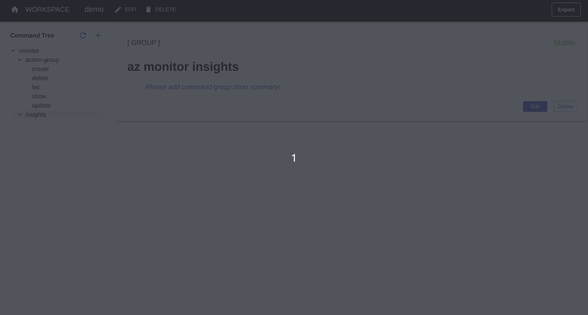

# Introduction to Workspace Editor

Workspaces are used to save and edit command models before exporting them to `aaz` repo. They are isolated with each other. So you can create multiple workspaces for different purpose. And they are saved in `~/.aaz/workspaces` folder by default.

## Workspace Editor Usage

When using aaz-dev from stratch, the workspace editor is the starting point. 

### Workspace operations

#### Create a workspace

In workspace page, the drop-dowm menu can select an existing workspace or create a new one.

#### Rename a workspace

Click the `EDIT` button you can rename the opened workspace.

#### Delete a workspace

Click the `DELETE` button you can delete the opened workspace. It requires to input workspace name again to confirm.

> **Warning**
> aaz-dev does not support __Undo__. Once the workspace is deleted you cannot get it back unless you use `git` to manage the workspaces folder (default path is `~/.aaz/workspaces`).

## Add Swagger Resources

When an empty workspace is opened, the `Add Swagger Resources` page will be prompted out by default.

For a workspace contains commands, click the `+` button besides the `command tree`, the `Add Swagger Resources` page will prompted out as well.

### Swagger Filters

The Swagger Filters can help you quickly filter out the resources to generate commands. They are

- Swagger Module selector
- Resource Provider selector
- API Version selector

### Pick Resource Urls

After the resources are filtered, you can select the resource urls on the right table.

> **Note**
> For the resources already added in the current workspace, their urls will be filtered out in the table. That's by design to avoid you add the same resource multiple times in one workspace, even in different api-versions is not allowed.

You can select them `All` or only pick some of them on demand which is recommended for beginners. You can also use the `Filter` bar to filter out a table by some keywords or the path key in swagger.

Click `Submit` button will generate command models in workspace and back to the workspace page. Those new commands are added in the command tree.

### Inherit modifications from exported command models

While adding a swagger resource, aaz-dev supports to inherit modifications directly from command models of the same resource generated and exported in `aaz` repo. This avoids many repetitive works. You can select different versions to inherit.

### The generation of `Update` commands

There are two mechanisms to implement `Update` in azure-cli.

- Generic Update: use `Get` request to fetch the resource, modify the resource and use `Put` request to submit the whole modified resource. About __99%__ `Update` commands in azure-cli use this mechanism.
- Patch Update: use `Patch` request to submit the change only.

There's three modes to control the generation of `Update` commands while add the resources.

- Generic(Get&Put) First: If the resource supports `Get` and `Put` methods, generate the _Generic Update_, else if it supports `Patch` method, it generate the _Patch Update_.
- Patch First: If the resource supports `Patch` method, it generate the _Patch Update_, else if it supports `Get` and `Put` methods.
- No update command: Never generate `Update` commands for the resource.

> **Note**
> This selection will apply to all the resources to submit. So if some of the resources should use a different mode, you should pick and submit them in the next new `Add Swagger Resources` page with a different mode.

### Issues while adding swagger

The aaz-dev tool uses strict mode to parse swagger. It will cause problems when adding swagger resources if the swagger files contains non-standard definitions. If you encounter such problem, you should check the __logs__ of aaz-dev __backend service__ and post it in [_Team Channel_](https://aka.ms/azure-cli-codegen-channel) or create a github issue.

## Modify Command Tree

All the commands in a workspace are organized in a tree view. When you rename or delete commands or command groups the tree view will be updated. Usually it is the first step after resources are added,

### Rename Command/Command Group

When you select a command or group name in the tree view, its details are displayed in the right area. Click the `Edit` button, you can rename it in the `Name` field. The name are composed of some keywords and are separated by spaces. Every keyword is represented for a node or leaf in the command tree. And the keywork should be in [Kebab_case](https://en.wikipedia.org/wiki/Letter_case#Kebab_case). You can reference [Command Naming Guideline](https://github.com/Azure/azure-cli/blob/dev/doc/command_guidelines.md#command-naming-and-behavior) for more information.

If you rename a group name, it will update all the elements names in its sub tree. If you add a new group name in a command, it will be moved to a new sub tree.

### Delete Command Group

You can delete an empty command group which has no commands in its sub tree. If it contains any commands, the `Delete` button is not clickable.

### Delete Commands

The commands in workspace are deleted by the swagger resource, if a resource generates `create`, `delete`, `update` and `show` commands, they will be deleted together.

> **Note**
> Sometime a command contains multiple resource urls, usually the `list` command. You should delete it multiple times. Because the resources should be removed one by one.

### Merge similar resource urls in one command

aaz-dev supports to merge similar resource urls in one command. But there are the following restrictions:

- All the resource urls are for the same resource, which means they should have the same swagger schema definition in responses.
- Every resource should **only** have a `GET` method. aaz-dev cannot support to merge `create`, `delete` or `update` command right now.

If you want to merge some resource urls in one command, you should select them in the same submission on `Add Swagger Resources` page.

But sometimes two resources cannot be merged because the `valid part` of the url is different. In this case, you can add one resource first and rename its command to the same command name as the resource you are adding next, then add the next resource.

> **Note**
> If you're trying to avoid the default merging behavior, you should can add one fist, rename the command to something different to avoid automatic merging, then add the following one.

## Modify Command Group

